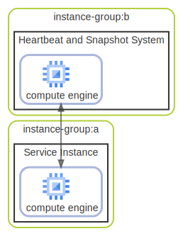

# instance-group

  [ <a href="../input/ndiag.descriptions/_layer-instance-group.md">:pencil2: Edit description</a> ]

## instance-group:a

  [ <a href="../input/ndiag.descriptions/_cluster-instance-group_a.md">:pencil2: Edit description</a> ]

### Nodes

| Name | Description |
| --- | --- |
| [Service Instance](node-service_instance.md) | <a href="../input/ndiag.descriptions/_node-service_instance.md">:pencil2:</a> |
## instance-group:b

  [ <a href="../input/ndiag.descriptions/_cluster-instance-group_b.md">:pencil2: Edit description</a> ]

### Nodes

| Name | Description |
| --- | --- |
| [Heartbeat and Snapshot System](node-heartbeat_and_snapshot_system.md) | <a href="../input/ndiag.descriptions/_node-heartbeat_and_snapshot_system.md">:pencil2:</a> |

---

> Generated by [ndiag](https://github.com/k1LoW/ndiag)
