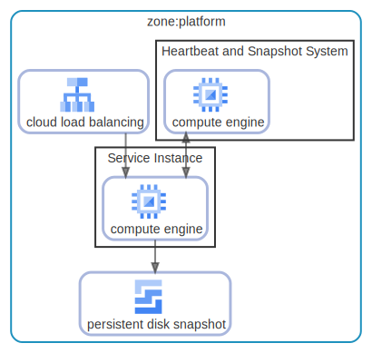

# zone

  [ <a href="../input/ndiag.descriptions/_layer-zone.md">:pencil2: Edit description</a> ]

## zone:platform

  [ <a href="../input/ndiag.descriptions/_cluster-zone_platform.md">:pencil2: Edit description</a> ]

### Cluster components

| Name | Description |
| --- | --- |
| zone:platform:cloud load balancing | <a href="../input/ndiag.descriptions/_component-zone_platform_cloud_load_balancing.md">:pencil2:</a> |
| zone:platform:persistent disk snapshot | <a href="../input/ndiag.descriptions/_component-zone_platform_persistent_disk_snapshot.md">:pencil2:</a> |
### Nodes

| Name | Description |
| --- | --- |
| [Service Instance](node-service_instance.md) | <a href="../input/ndiag.descriptions/_node-service_instance.md">:pencil2:</a> |
| [Heartbeat and Snapshot System](node-heartbeat_and_snapshot_system.md) | <a href="../input/ndiag.descriptions/_node-heartbeat_and_snapshot_system.md">:pencil2:</a> |

---

> Generated by [ndiag](https://github.com/k1LoW/ndiag)
