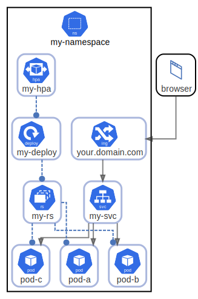

# Exposed Pod with 3 replicas

see https://github.com/kubernetes/community/tree/master/icons#usage-example

  [ <a href="../input/ndiag.descriptions/_index.md">:pencil2: Edit description</a> ]

## Diagrams

| Name | Description |
| --- | --- |
| [Nodes](diagram-nodes.md) | <a href="../input/ndiag.descriptions/_diagram-nodes.md">:pencil2:</a> |

## Layers

| Name | Description |
| --- | --- |
| [netpol](layer-netpol.md) | <a href="../input/ndiag.descriptions/_layer-netpol.md">:pencil2:</a> |
| [limits](layer-limits.md) | <a href="../input/ndiag.descriptions/_layer-limits.md">:pencil2:</a> |
| [quota](layer-quota.md) | <a href="../input/ndiag.descriptions/_layer-quota.md">:pencil2:</a> |

## Nodes

| Name | Description |
| --- | --- |
| [my-namespace](node-my-namespace.md) | <a href="../input/ndiag.descriptions/_node-my-namespace.md">:pencil2:</a> |

## Labels

| Name | Description |
| --- | --- |

---

> Generated by [ndiag](https://github.com/k1LoW/ndiag)
