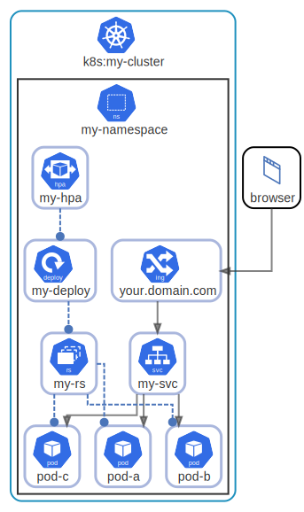

# overview

  [ <a href="../input/ndiag.descriptions/_diagram-overview.md">:pencil2: Edit description</a> ]

## Layers

| Name | Description |
| --- | --- |
| [k8s](layer-k8s.md) | <a href="../input/ndiag.descriptions/_layer-k8s.md">:pencil2:</a> |

## Nodes

| Name | Description |
| --- | --- |
| [my-namespace](node-my-namespace.md) | <a href="../input/ndiag.descriptions/_node-my-namespace.md">:pencil2:</a> |

## Labels

| Name | Description |
| --- | --- |
| [limits:b](label-limits_b.md) | <a href="../input/ndiag.descriptions/_label-limits_b.md">:pencil2:</a> |
| [netpol:a](label-netpol_a.md) | <a href="../input/ndiag.descriptions/_label-netpol_a.md">:pencil2:</a> |
| [quota:c](label-quota_c.md) | <a href="../input/ndiag.descriptions/_label-quota_c.md">:pencil2:</a> |

---

> Generated by [ndiag](https://github.com/k1LoW/ndiag)
