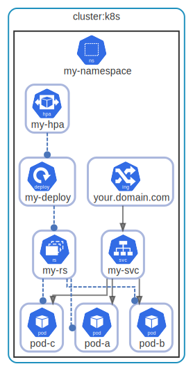

# cluster

  [ <a href="../input/ndiag.descriptions/_layer-cluster.md">:pencil2: Edit description</a> ]

## cluster:k8s

  [ <a href="../input/ndiag.descriptions/_cluster-cluster_k8s.md">:pencil2: Edit description</a> ]

### Nodes

| Name | Description |
| --- | --- |
| [my-namespace](node-my-namespace.md) | <a href="../input/ndiag.descriptions/_node-my-namespace.md">:pencil2:</a> |

---

> Generated by [ndiag](https://github.com/k1LoW/ndiag)
