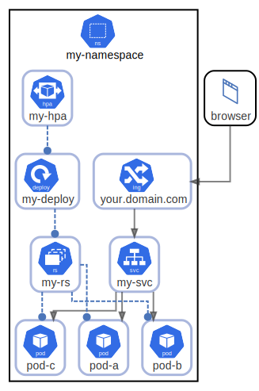

# my-namespace

  [ <a href="../input/ndiag.descriptions/_node-my-namespace.md">:pencil2: Edit description</a> ]

## Components

| Name | Description | From (Relation) | To (Relation) |
| --- | --- | --- | --- |
| my-namespace:your.domain.com |  <a href="../input/ndiag.descriptions/_component-my-namespace_your.domain.com.md">:pencil2:</a> | browser | [my-namespace:my-svc](node-my-namespace.md) |
| my-namespace:my-svc |  <a href="../input/ndiag.descriptions/_component-my-namespace_my-svc.md">:pencil2:</a> | [my-namespace:your.domain.com](node-my-namespace.md) | [my-namespace:pod-a](node-my-namespace.md) / [my-namespace:pod-b](node-my-namespace.md) / [my-namespace:pod-c](node-my-namespace.md) |
| my-namespace:pod-a |  <a href="../input/ndiag.descriptions/_component-my-namespace_pod-a.md">:pencil2:</a> | [my-namespace:my-svc](node-my-namespace.md) / [my-namespace:my-rs](node-my-namespace.md) |  |
| my-namespace:pod-b |  <a href="../input/ndiag.descriptions/_component-my-namespace_pod-b.md">:pencil2:</a> | [my-namespace:my-svc](node-my-namespace.md) / [my-namespace:my-rs](node-my-namespace.md) |  |
| my-namespace:pod-c |  <a href="../input/ndiag.descriptions/_component-my-namespace_pod-c.md">:pencil2:</a> | [my-namespace:my-svc](node-my-namespace.md) / [my-namespace:my-rs](node-my-namespace.md) |  |
| my-namespace:my-hpa |  <a href="../input/ndiag.descriptions/_component-my-namespace_my-hpa.md">:pencil2:</a> |  | [my-namespace:my-deploy](node-my-namespace.md) |
| my-namespace:my-deploy |  <a href="../input/ndiag.descriptions/_component-my-namespace_my-deploy.md">:pencil2:</a> | [my-namespace:my-hpa](node-my-namespace.md) | [my-namespace:my-rs](node-my-namespace.md) |
| my-namespace:my-rs |  <a href="../input/ndiag.descriptions/_component-my-namespace_my-rs.md">:pencil2:</a> | [my-namespace:my-deploy](node-my-namespace.md) | [my-namespace:pod-a](node-my-namespace.md) / [my-namespace:pod-b](node-my-namespace.md) / [my-namespace:pod-c](node-my-namespace.md) |

## Labels

| Name | Description |
| --- | --- |

---

> Generated by [ndiag](https://github.com/k1LoW/ndiag)
