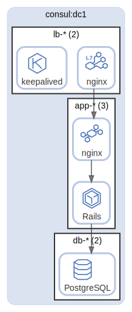

# consul

Consul DC

  [ <a href="../input/ndiag.descriptions/_layer-consul.md">:pencil2: Edit description</a> ]

## consul:dc1

  [ <a href="../input/ndiag.descriptions/_cluster-consul_dc1.md">:pencil2: Edit description</a> ]

### Nodes

| Name (node count) | Description |
| --- | --- |
| [lb-*](node-lb-_.md) (2) | Load balancer |
| [app-*](node-app-_.md) (3) | Application |
| [db-*](node-db-_.md) (2) | Database |

---

> Generated by [ndiag](https://github.com/k1LoW/ndiag)
