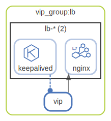

# vip_group

A group of virtual IP and nodes/components to handle it.

  [ <a href="../input/ndiag.descriptions/_layer-vip_group.md">:pencil2: Edit description</a> ]

## vip_group:lb

  [ <a href="../input/ndiag.descriptions/_cluster-vip_group_lb.md">:pencil2: Edit description</a> ]

### Cluster components

| Name | Description |
| --- | --- |
| vip_group:lb:vip | <a href="../input/ndiag.descriptions/_component-vip_group_lb_vip.md">:pencil2:</a> |
### Nodes

| Name (node count) | Description |
| --- | --- |
| [lb-*](node-lb-_.md) (2) | Load balancer |

---

> Generated by [ndiag](https://github.com/k1LoW/ndiag)
