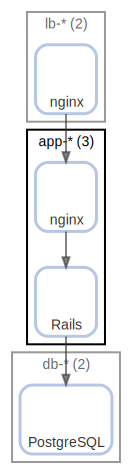

# app-*

Application

  [ <a href="../input/ndiag.descriptions/_node-app-_.md">:pencil2: Edit description</a> ]

## Components

| Name | Description | From (Relation) | To (Relation) |
| --- | --- | --- | --- |
| app-*:nginx |  <a href="../input/ndiag.descriptions/_component-app-__nginx.md">:pencil2:</a> | [lb-*:nginx](node-lb-_.md) | [app-*:rails](node-app-_.md) |
| app-*:rails |  <a href="../input/ndiag.descriptions/_component-app-__rails.md">:pencil2:</a> | [app-*:nginx](node-app-_.md) | [db-*:postgresql](node-db-_.md) |

## Labels

| Name | Description |
| --- | --- |
| [http](label-http.md) | HTTP request flow |
| [app](label-app.md) | App-DB |
## Real nodes

- app-1
- app-2
- app-3

---

> Generated by [ndiag](https://github.com/k1LoW/ndiag)
