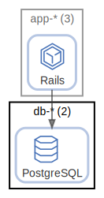

# db-*

Database

  [ <a href="../input/ndiag.descriptions/_node-db-_.md">:pencil2: Edit description</a> ]

## Components

| Name | Description | From (Relation) | To (Relation) |
| --- | --- | --- | --- |
| db-*:postgresql |  <a href="../input/ndiag.descriptions/_component-db-__postgresql.md">:pencil2:</a> | [app-*:rails](node-app-_.md) |  |

## Label groups

| Name | Description |
| --- | --- |
| [app](label-app.md) | App-DB |
## Real nodes

- db-1
- db-2

---

> Generated by [ndiag](https://github.com/k1LoW/ndiag)
