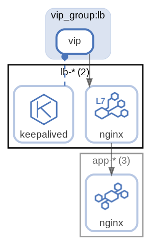

# lb-*

Load balancer

  [ <a href="../input/ndiag.descriptions/_node-lb-_.md">:pencil2: Edit description</a> ]

## Components

| Name | Description | From (Relation) | To (Relation) |
| --- | --- | --- | --- |
| lb-*:nginx |  <a href="../input/ndiag.descriptions/_component-lb-__nginx.md">:pencil2:</a> | [vip_group:lb:vip](layer-vip_group.md#vip_grouplb) | [app-*:nginx](node-app-_.md) |
| lb-*:keepalived |  <a href="../input/ndiag.descriptions/_component-lb-__keepalived.md">:pencil2:</a> |  | [vip_group:lb:vip](layer-vip_group.md#vip_grouplb) |

## Tag groups

| Name | Description |
| --- | --- |
| [http](tag-http.md) | HTTP request flow |
| [app](tag-app.md) | App-DB |
## Real nodes

- lb-1
- lb-2

---

> Generated by [ndiag](https://github.com/k1LoW/ndiag)
