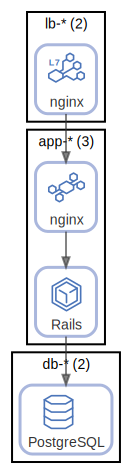

# app

App-DB

  [ <a href="../input/ndiag.descriptions/_tag-app.md">:pencil2: Edit description</a> ]

## Components
| # | Name | Description |
| --- | --- | --- |
| 0 | lb-*:nginx |  <a href="../input/ndiag.descriptions/_component-lb-__nginx.md">:pencil2:</a> |
| 1 | app-*:nginx |  <a href="../input/ndiag.descriptions/_component-app-__nginx.md">:pencil2:</a> |
| 2 | app-*:rails |  <a href="../input/ndiag.descriptions/_component-app-__rails.md">:pencil2:</a> |

| # | Name | Description |
| --- | --- | --- |
| 0 | app-*:rails |  <a href="../input/ndiag.descriptions/_component-app-__rails.md">:pencil2:</a> |
| 1 | db-*:postgresql |  <a href="../input/ndiag.descriptions/_component-db-__postgresql.md">:pencil2:</a> |

---

> Generated by [ndiag](https://github.com/k1LoW/ndiag)
